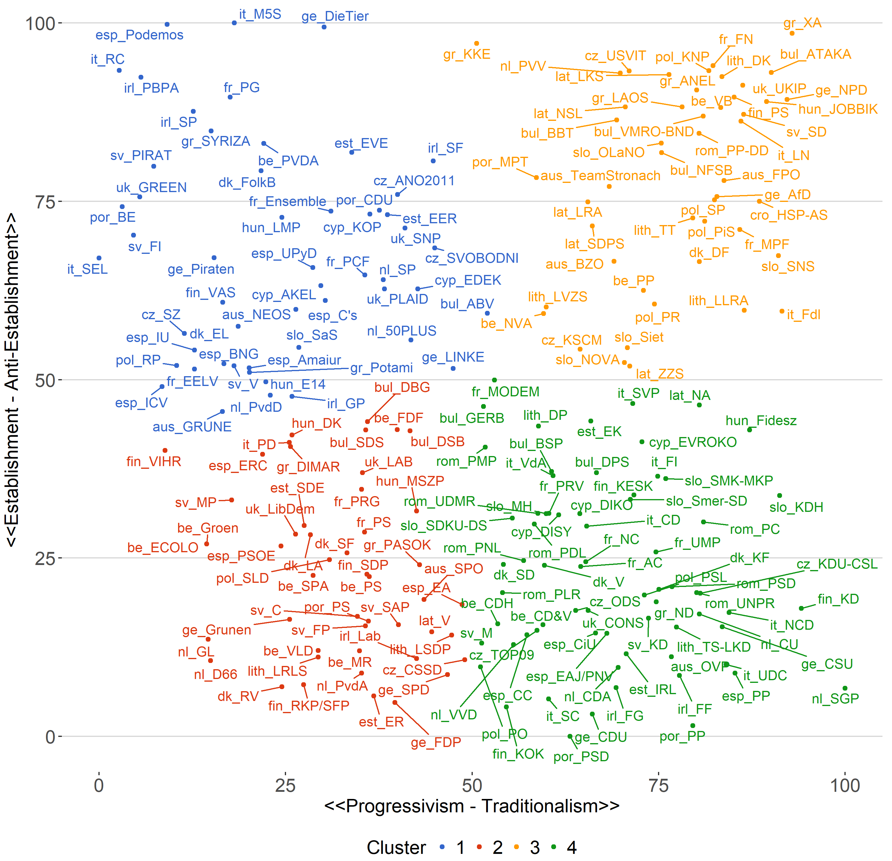

 
 
 
 
 
 
 
 

.onehundredtwenty[

Goal:

> Distinguish between and investigate different types of populism

]

---

## Outline

.onehundredtwenty[

1. Challenges & Shortcomings
2. Progressive and Traditionalist Populists
3. Data & Methods
4. Results
5. Conclusions & Future Research

]

---

class: inverse, center, middle

## Get Started

---

class: inverse, center, middle

## Challenges & Shortcomings

---

## Challenges & Shortcomings

---

---

## The Problem with Definitions

Left/Right?

 
 

Liberal/Illiberal?

 
 

Inclusionary/Exclusionary

 
 

Progressive and Traditionalist?

---

class: inverse, center, middle

## Data & Methods

---

## Data & Methods

**CHES Dataset**

Positions of 365 political parties in 40 European countries on european and national policy issues in the timerange between 1999 and 2014.

--

**Minimalist Definition of Populism**

+ *Salience of anti-establishment and anti-elite rhetoric*
+ *Overall orientation of the party leadership towards European integration*

--

**Progressive vs. Traditionalist Populism**

+ *Green-Alternative-Libertarian (GAL) and Traditional-Authoritarian-Nationalist (TAN)*
+ *Position on social lifestyle (e.g. homosexuality)*
+ *Position on civil liberties vs. law and order*

---

### Data & Methods

---

class: center, middle

---

### Data & Methods

**Merging with ESS (5-8)**

Two variables will be used to measure our *dependent variable*:

1. What party did you vote for in the last national election?
2. Which party is closest to your views?

--

**Resulting DV has three categories:**

Support for Establishment/Traditionalist & Progressive Populist Parties 

--

**Multinomial Regression:**

Independent Variables: 

*Economic Insecurity, Unemployment, Welfare, Anti-Immigration Sentiment, Age, Education, Sex,Left-Right Scale, Religiosity, Government Satisfaction, Trust in Global Governance, Rural vs. Urban. Regional dummies (East, West, North and Southern Europe) and temporal dummies (2010, 2012, 2014 and 2016)*

**Total: 68.403 respondents in 22 countries**

---

class: center, middle

---

class: inverse, center, middle

## Results

---

---

---

---

class: inverse, center, middle

## Conclusions

---

## Conclusions

+ Our conceptualization seems to be valid
+ Our conceptualization could be checked/validated by others
+ Communist parties may represent special cases with regard to our conceptualization
+ Multivel and bayesian modeling would be useful as well
+ Many missing values (include non-aligned in multiomial model?)

---

class: inverse, center, middle

## Thanks for Listening!

Slides: <a href='variants-of-populism.netlify.com'>https://variants-of-populism.netlify.com/ </a>

Code and Data on <a href='https://github.com/favstats/DecodingTheAltRight'>GitHub</a>

---

## References

Hawley, G. (2017). Making Sense of the Alt-right. Columbia University Press.

Marwick, A., & Lewis, R. (2017). Media manipulation and disinformation online. New York: Data & Society Research Institute.

---

class: inverse, center, middle

## Appendix
